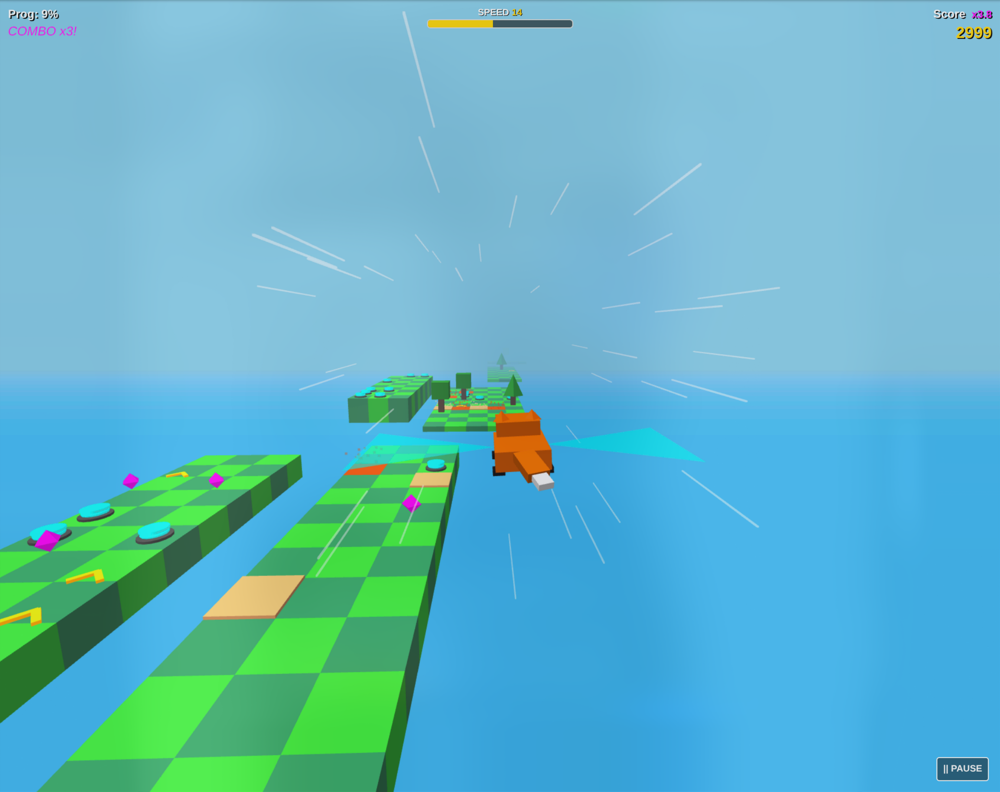
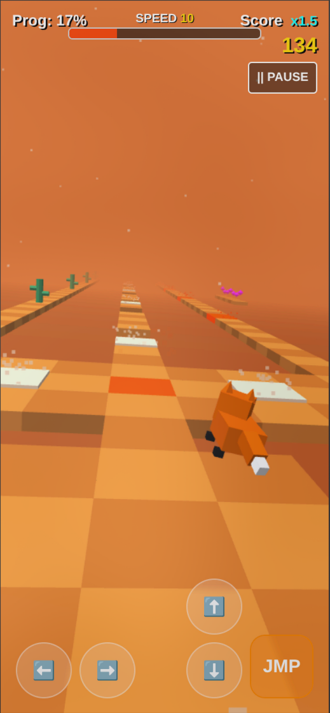
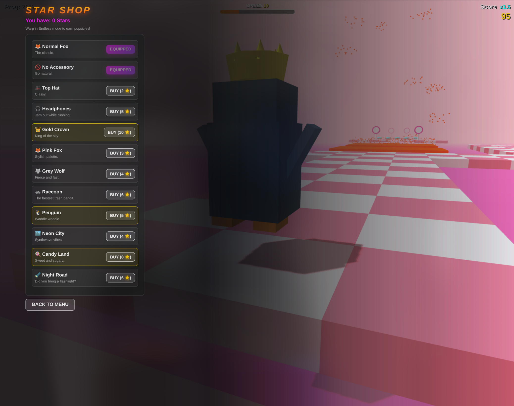
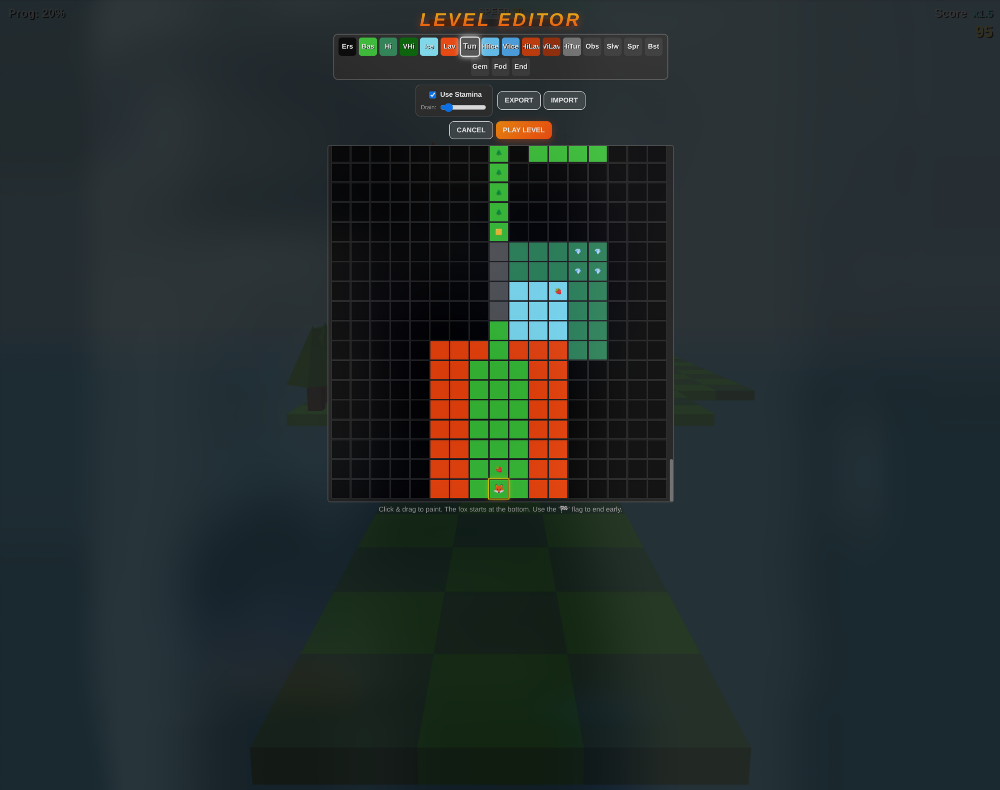

# Sky Fox
Sky Fox - a super-addictive, browser-based SkyRoads-inspired 3D platforming game!

A lightweight, 3D endless runner built entirely with vanilla JavaScript and Three.js.

🎮 **[Play Here!](https://sefn.github.io/skyfox/skyfox.html)**

*(Works on Desktop and Mobile!)*

---

## 📸 Screenshots


|  |  |  |  
|:---:|:---:|:---:|:---:|
| *Procedurally generated 3D tracks* | *Mobile-friendly and custom levels* | *Level editor with import/export functionality* | *In-game shop and unlockables* |

---

## 🎮 Game Features

* **Procedural Generation:** The track dynamically builds itself infinitely, increasing in difficulty and hazard density as you survive and warp to new levels (where the theme changes and Stars are earned)!
* **Custom Physics:** Jumping, double-jumping, and gliding across SkyRoads-inspired tracks with special tiles and obstacles.
* **Different Game Modes:** Jumping over randomly generated levels, gliding in the Aero Rush mode, or playing my hand-crafted levels or creating your own - there's a lot of content to enjoy and create! You can play with or without Stamina, requiring you to gather berries to survive on your way. 
* **In-Game Economy:** Collect Stars to unlock new characters, accessories, and world themes via the shop!
* **Level Editor:** A built-in grid editor allowing players to paint and test their own custom levels instantly!
* **Responsive Controls:** Supports keyboard, mobile touch buttons, and mobile Gyroscope tilt controls!

---

## 💻 Tech Stack

* **Frontend:** HTML5, CSS3, Vanilla JavaScript (ES6+)
* **3D Rendering:** [Three.js (r128)](https://threejs.org/) 
* **Hosting:** GitHub Pages
* **CI/CD:** GitHub Actions

---

## 🏃‍♂️ Running Locally

Because the project uses no build steps or bundlers, running it locally is incredibly simple. You just need to serve the static files.

1. Clone the repository:
   ```bash
   git clone https://github.com/sefn/skyfox.git
   cd skyfox

2. Run skyfox.html
